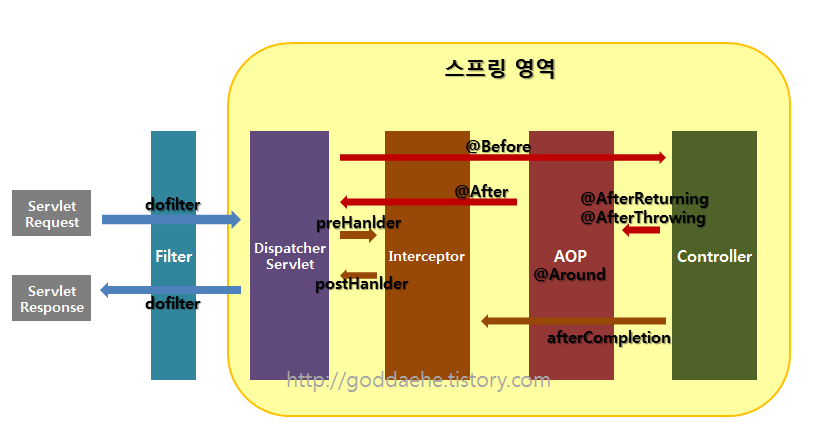

## Interceptor란
* HttpRequest, HttpResponse를 가로채는 역할.
* DispatcherServlet에서 해당 Controller가 처리되기 전과 후에 발생하는 이벤트.
* 아래 이미지 처럼 DispatcherServlet와 Controller 사이에서 동작
* 스프링에서 동작하므로 모든 빈에 접근 가능.

\
(https://goddaehee.tistory.com/154)

## 요구 사항
* 들어온 유저의 웹 요청에 대한 카운트를 일자 및 시간별로 DB에 저장.

## 기존 소스 문제점
* request 스코프를 이용해 요청 때마다 사용자의 요청 카운트를 저장해주려 함.
    * request 스코프는 웹 요청이 들어오고 나갈때 까지 유지되는 스코프.
* 그러나 스코프를 사용하면 요청시작때 빈이 생성되고 응답이 나가면 빈이 종료됨.
    * -> 결국 요청과 응답마다 빈이 계속 생성되고 종료되는 상황 발생.
* 위와 같은 상황은 효율적이지 않아 Interceptor를 사용.

## Interceptor 적용
두가지 방법으로 적용 가능
* HandlerInterceptor 인터페이스 구현 (스프링 추천 방식)
* HandlerInterceptorAdaptor 추상 클래스 상속

HandlerInterceptor 인터페이스로 구현
```java
...
import io.jsonwebtoken.Claims;
import javax.servlet.http.HttpServletRequest;
import javax.servlet.http.HttpServletResponse;
import lombok.RequiredArgsConstructor;
import org.springframework.stereotype.Component;
import org.springframework.util.StringUtils;
import org.springframework.web.servlet.HandlerInterceptor;
import org.springframework.web.servlet.ModelAndView;

@Component
@RequiredArgsConstructor
public class ActionLogInterceptor implements HandlerInterceptor {

    private final StatsService statsService;
    private final TokenProvider tokenProvider;

    @Override
    public boolean preHandle(HttpServletRequest request, HttpServletResponse response, Object handler)
            throws Exception {
        String bearerToken = request.getHeader(AUTHORIZATION_HEADER);
        if (StringUtils.hasText(bearerToken) && bearerToken.startsWith(BEARER_PREFIX)) {
            bearerToken =  bearerToken.substring(7);
        }else{
            return false;
        }
        Claims claims = tokenProvider.parseClaims(bearerToken);
        statsService.setStatsActionLog(Long.valueOf(claims.get("deviceId").toString()));
        return true;
    }

    @Override
    public void postHandle(HttpServletRequest request, HttpServletResponse response, Object handler,
            ModelAndView modelAndView) throws Exception {
        //do nothing
    }

    @Override
    public void afterCompletion(HttpServletRequest request, HttpServletResponse response, Object handler, Exception ex)
            throws Exception {
        //do nothing
    }
}

```
* preHandle: 컨트롤러의 동작 이전에 가로채는 역할로 사용.
    * return true일때 핸들러의 다음 동작이 실행.
    * false일 경우 중단. 그 뒤 동작이 진행되지 않음.
* postHandle: 컨트롤러의 동작 이후에 처리. DispatcherServlet이 화면을 처리하기 전에 동작.
* afterCompletion: DispatcherSerlvet의 화면 처리가 완료된 상태에서 처리.

파라미터는 공통적으로 3가지를 받음.
* HttpServletRequest
* HttpServletResponse
* Object handler
    * 현재 실행하려는 메소드 자체를 의미
    * 현재 실행 컨트롤러 파악 / 추가적인 메소드 실행
    * 많이 쓰일지는... 글쎄...

Interceptor 동작을 위한 설정 추가
```java
...
import lombok.RequiredArgsConstructor;
import org.springframework.context.annotation.Configuration;
import org.springframework.web.servlet.config.annotation.InterceptorRegistry;
import org.springframework.web.servlet.config.annotation.WebMvcConfigurer;

@Configuration
@RequiredArgsConstructor
public class WebMvcConfig implements WebMvcConfigurer {

    private final StatsService statsService;
    private final TokenProvider tokenProvider;

    @Override
    public void addInterceptors(InterceptorRegistry registry) {
        registry.addInterceptor(new ActionLogInterceptor(statsService, tokenProvider))
                .addPathPatterns("/**")
                .excludePathPatterns("/app/docs")
                .excludePathPatterns("/swagger-resources")
                .excludePathPatterns("/swagger-resources/**")
                .excludePathPatterns("/configuration/ui")
                .excludePathPatterns("/configuration/security")
                .excludePathPatterns("/swagger-ui.html")
                .excludePathPatterns("/**/swagger-*/**")
                .excludePathPatterns("/**/v2/**")
                .excludePathPatterns("/**/system/health-check")
                .excludePathPatterns("/error")
        ;
    }
}
```
WebMvcConfigurer를 구현하는 Config 클래스 추가. addInterceptors 메소드를 이용해 Interceptor 추가.
* addInterceptor: registry에 등록할 Interceptor 추가.
* addPathPatterns: 적용할 url 패턴을 설정 (Array 설정 가능)
* excludePathPatterns: 적용 제외할 url 패턴을 설정 (Array 설정 가능)

## 참고 레퍼런스
https://gngsn.tistory.com/153 \
https://velog.io/@ililil9482/Spring-Interceptor-%EC%A0%81%EC%9A%A9%ED%95%98%EA%B8%B0 \
https://goddaehee.tistory.com/154