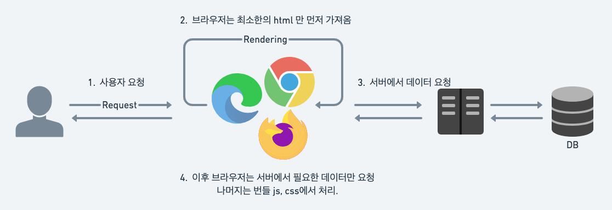
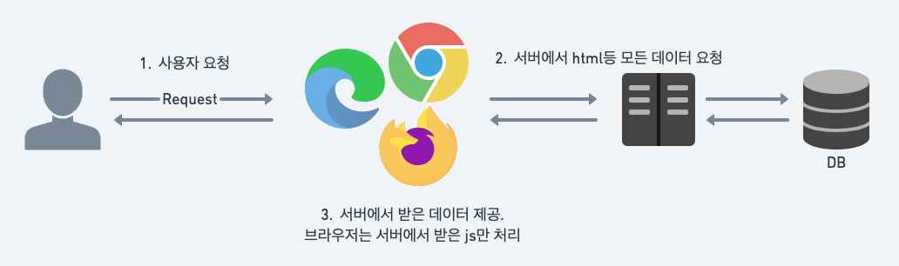

# CSR과 SSR

### 브라우저 랜더링
브라우저 랜더링이란 브라우저가 서버로 부터 요청하여 받은 내용을 브라우저에 그려주는 작업.  
서버로부터 HTML, Css, Javascript 등을 받아 브라우저에 화면을 표시해줌.

**CSR(Client Side Rendering)** 과 **SSR(Server Side Rendering)** 방식이 있음.

### CSR(Client Side Rendering)
- 클라이언트인 브라우저가 랜더링을 처리하는 방식.
- 모든 js와 css 파일을 하나의 파일로 번들링 됨.
- 브라우저에서 사용자 요청 시 번들링 파일을 분석해 렌더링 해줌.
- SPA 로 구성된 사이트에서 많이 사용.

#### 장점
- 빠른 속도와 서버부담 감소.
    - 변경된 부분과 관련된 데이터만 서버에서 가져오므로 속도가 빠르다.
    - 서버는 필요한 데이터만 제공하므로 부담이 적어진다.
- 사용자 친화적
    - 링크가 없기 때문에 페이지 이동 시 빠른 이동이 가능.

#### 단점
- 최초 호출 시 느린 속도
    - 호출 시 자바스크립트, CSS, HTML 등의 파일을 모두 불러오기 때문에 속도 저하 발생
- SEO(Search Engine Optimization) 에 불리
    - 검색엔진 크롤러가 CSR 사이트를 크롤링 하지 못함(방문하면 스크립트가 실행되지 않은 빈 페이지이기 때문).
    - 각 페이지에 meta 세팅을 위한 별도의 처리가 필요함.
- 클라이언트 사양에 의존적
    - 클라이언트 사양에 따라 속도의 차이가 나타나게 됨.

### SSR(Server Side Rendering)
- 서버에서 모든 랜더링을 마친 후 클라이언트에 전달해주는 방식.
- 각 URL 마다 서버가 요청을 받아 렌더링을 처리.
- 브라우저는 서버에서 제공한 파일을 표시하고 스크립트 처리만 진행.
- MPA 로 구성된 사이트에서 많이 사용.

#### 장점
- 최초 호출 시 빠른 속도
    - 바로 렌더링이 가능한 HTML 파일만을 불러오는 것이기 때문에 속도가 더 빠름.
- SEO 에 유리
    - 각 URL 마다 이미 서버에서 렌더링된 페이지가 존재하므로 사이트 크롤링이 가능.
    - 서버단에서 이미 meta 세팅이 된 HTML 을 렌더링하므로 별도 meta 처리가 필요없음.

#### 단점
- 서버의 부담 증가
    - 페이지 호출 시 전체 데이터를 서버에서 받아와야 하여 부담 증가.
    - 반면 클라이언트는 렌더링 준비된 페이지를 가져오므로 부담이 적어짐.
- 서버 호스팅 필요
    - HTML 파일 및 안에 내용들이 있어야 하므로 서버 호스팅은 불가피함.
- 페이지 크기에 따라 속도 영향
    - 페이지 크기가 클수록 렌더링에 시간이 더 걸림.

### 용도 별 사용법
프로젝트, 서비스, 개발 환경등에 따라 선택하여 사용 가능하다.

#### CSR
- 서버의 성능이 좋지 않을 때
- SPA 페이지 개발 시
- 소규모 프로젝트 개발 시
- SEO 가 필요 없을 경우

#### SSR
- 서버의 성능이 괜찮을 때
- MPA 페이지 개발 시
- 중, 대규모 프로젝트 개발 시
- SEO 가 필요 할 경우

### 참고 URL
- https://blog.itcode.dev/posts/2022/06/12/csr-ssr-ssg
- https://velog.io/@vagabondms/%EA%B8%B0%EC%88%A0-%EC%8A%A4%ED%84%B0%EB%94%94-SSR%EA%B3%BC-CSR%EC%9D%98-%EC%B0%A8%EC%9D%B4?utm_source=pocket_reader
- https://ajdkfl6445.gitbook.io/study/web/csr-vs-ssr-vs-ssg?utm_source=pocket_saves

