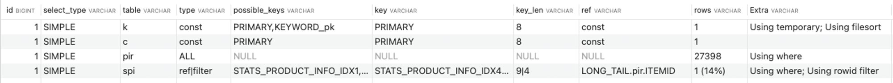
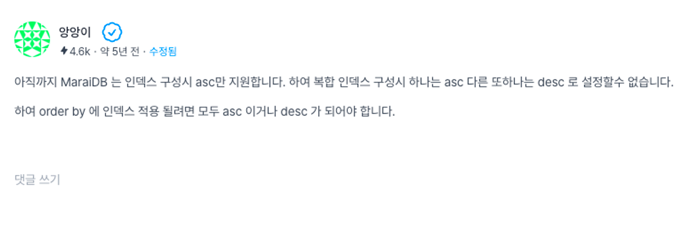
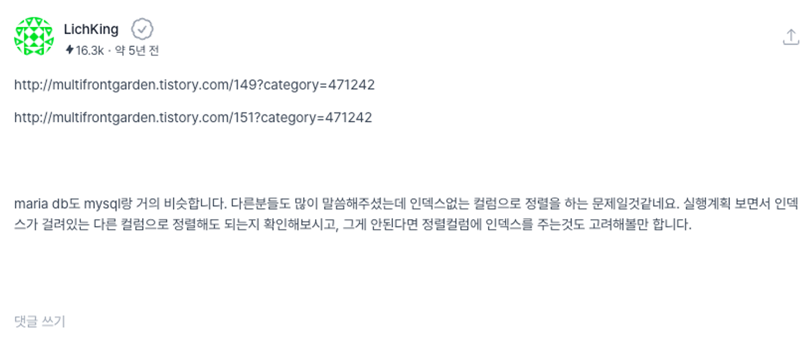

### 문제점

통계 데이터 갱신을 위한 API 호출 시 갱신 시간이 오래 걸리는 이슈가 발생했다.(한달치 2시간)  
반복문이 돌 때마다 RankChannelProduct 갱신 속도가 점점 느려지는 현상이었다. (하루데이터 처리 최소 10s ->최대 110s)
해당 로직은 하루치 데이터를 카테고리 별로 분류하고, 분류된 카테고리 개수만큼 통계를 처리하는 로직이다. 카테고리 하나당 평균 처리시간은 1s ~ 5s 이다.

```java
[ERROR] 2023/11/27 14:37:23.105[XNIO-1 task-2][129143] c.m.s.f.batch.StatsDataService.setStatsData[line:64] - date: 20231026
[ERROR] 2023/11/27 14:37:26.061[XNIO-1 task-2][132099] c.m.s.f.batch.StatsDataService.rankChannelProduct[line:761] - rankChannelProduct Time: 1550
[ERROR] 2023/11/27 14:37:28.616[XNIO-1 task-2][134654] c.m.s.f.batch.StatsDataService.rankChannelProduct[line:761] - rankChannelProduct Time: 1424
[ERROR] 2023/11/27 14:37:31.219[XNIO-1 task-2][137257] c.m.s.f.batch.StatsDataService.rankChannelProduct[line:761] - rankChannelProduct Time: 1449
[ERROR] 2023/11/27 14:37:34.366[XNIO-1 task-2][140404] c.m.s.f.batch.StatsDataService.rankChannelProduct[line:761] - rankChannelProduct Time: 1638
[ERROR] 2023/11/27 14:37:37.771[XNIO-1 task-2][143809] c.m.s.f.batch.StatsDataService.rankChannelProduct[line:761] - rankChannelProduct Time: 1613
[ERROR] 2023/11/27 14:37:40.460[XNIO-1 task-2][146498] c.m.s.f.batch.StatsDataService.rankChannelProduct[line:761] - rankChannelProduct Time: 1485
[ERROR] 2023/11/27 14:37:43.101[XNIO-1 task-2][149139] c.m.s.f.batch.StatsDataService.rankChannelProduct[line:761] - rankChannelProduct Time: 1438
[ERROR] 2023/11/27 14:37:47.134[XNIO-1 task-2][153172] c.m.s.f.batch.StatsDataService.rankChannelProduct[line:761] - rankChannelProduct Time: 1683
[ERROR] 2023/11/27 14:37:50.000[XNIO-1 task-2][156038] c.m.s.f.batch.StatsDataService.rankChannelProduct[line:761] - rankChannelProduct Time: 1507
[ERROR] 2023/11/27 14:37:52.762[XNIO-1 task-2][158800] c.m.s.f.batch.StatsDataService.rankChannelProduct[line:761] - rankChannelProduct Time: 1511
[ERROR] 2023/11/27 14:37:56.102[XNIO-1 task-2][162140] c.m.s.f.batch.StatsDataService.rankChannelProduct[line:761] - rankChannelProduct Time: 1728
[ERROR] 2023/11/27 14:37:59.732[XNIO-1 task-2][165770] c.m.s.f.batch.StatsDataService.rankChannelProduct[line:761] - rankChannelProduct Time: 1650
[ERROR] 2023/11/27 14:38:03.148[XNIO-1 task-2][169186] c.m.s.f.batch.StatsDataService.rankChannelProduct[line:761] - rankChannelProduct Time: 1638
[ERROR] 2023/11/27 14:38:06.874[XNIO-1 task-2][172912] c.m.s.f.batch.StatsDataService.rankChannelProduct[line:761] - rankChannelProduct Time: 1811
[ERROR] 2023/11/27 14:38:10.233[XNIO-1 task-2][176271] c.m.s.f.batch.StatsDataService.rankChannelProduct[line:761] - rankChannelProduct Time: 1701
[ERROR] 2023/11/27 14:38:13.786[XNIO-1 task-2][179824] c.m.s.f.batch.StatsDataService.rankChannelProduct[line:761] - rankChannelProduct Time: 1708
[ERROR] 2023/11/27 14:38:17.310[XNIO-1 task-2][183348] c.m.s.f.batch.StatsDataService.rankChannelProduct[line:761] - rankChannelProduct Time: 1681
[ERROR] 2023/11/27 14:38:20.495[XNIO-1 task-2][186533] c.m.s.f.batch.StatsDataService.rankChannelProduct[line:761] - rankChannelProduct Time: 1671
[ERROR] 2023/11/27 14:38:23.662[XNIO-1 task-2][189700] c.m.s.f.batch.StatsDataService.rankChannelProduct[line:761] - rankChannelProduct Time: 1655
[ERROR] 2023/11/27 14:38:26.826[XNIO-1 task-2][192864] c.m.s.f.batch.StatsDataService.rankChannelProduct[line:761] - rankChannelProduct Time: 1647
[ERROR] 2023/11/27 14:38:30.140[XNIO-1 task-2][196178] c.m.s.f.batch.StatsDataService.rankChannelProduct[line:761] - rankChannelProduct Time: 1679
[ERROR] 2023/11/27 14:38:33.450[XNIO-1 task-2][199488] c.m.s.f.batch.StatsDataService.rankChannelProduct[line:761] - rankChannelProduct Time: 1671

[ERROR] 2023/11/27 14:41:44.191[XNIO-1 task-2][390229] c.m.s.f.batch.StatsDataService.setStatsData[line:64] - date: 20231029
[ERROR] 2023/11/27 14:41:49.357[XNIO-1 task-2][395395] c.m.s.f.batch.StatsDataService.rankChannelProduct[line:761] - rankChannelProduct Time: 2798
[ERROR] 2023/11/27 14:41:53.879[XNIO-1 task-2][399917] c.m.s.f.batch.StatsDataService.rankChannelProduct[line:761] - rankChannelProduct Time: 2550
[ERROR] 2023/11/27 14:41:58.134[XNIO-1 task-2][404172] c.m.s.f.batch.StatsDataService.rankChannelProduct[line:761] - rankChannelProduct Time: 2232
[ERROR] 2023/11/27 14:42:03.874[XNIO-1 task-2][409912] c.m.s.f.batch.StatsDataService.rankChannelProduct[line:761] - rankChannelProduct Time: 3142
[ERROR] 2023/11/27 14:42:08.966[XNIO-1 task-2][415004] c.m.s.f.batch.StatsDataService.rankChannelProduct[line:761] - rankChannelProduct Time: 2430
[ERROR] 2023/11/27 14:42:13.152[XNIO-1 task-2][419190] c.m.s.f.batch.StatsDataService.rankChannelProduct[line:761] - rankChannelProduct Time: 2164
[ERROR] 2023/11/27 14:42:17.294[XNIO-1 task-2][423332] c.m.s.f.batch.StatsDataService.rankChannelProduct[line:761] - rankChannelProduct Time: 2156
[ERROR] 2023/11/27 14:42:23.157[XNIO-1 task-2][429195] c.m.s.f.batch.StatsDataService.rankChannelProduct[line:761] - rankChannelProduct Time: 2543
[ERROR] 2023/11/27 14:42:27.429[XNIO-1 task-2][433467] c.m.s.f.batch.StatsDataService.rankChannelProduct[line:761] - rankChannelProduct Time: 2246
[ERROR] 2023/11/27 14:42:32.245[XNIO-1 task-2][438283] c.m.s.f.batch.StatsDataService.rankChannelProduct[line:761] - rankChannelProduct Time: 2510
[ERROR] 2023/11/27 14:42:37.601[XNIO-1 task-2][443639] c.m.s.f.batch.StatsDataService.rankChannelProduct[line:761] - rankChannelProduct Time: 2722
[ERROR] 2023/11/27 14:42:42.868[XNIO-1 task-2][448906] c.m.s.f.batch.StatsDataService.rankChannelProduct[line:761] - rankChannelProduct Time: 2276
[ERROR] 2023/11/27 14:42:47.337[XNIO-1 task-2][453375] c.m.s.f.batch.StatsDataService.rankChannelProduct[line:761] - rankChannelProduct Time: 2214
[ERROR] 2023/11/27 14:42:53.129[XNIO-1 task-2][459167] c.m.s.f.batch.StatsDataService.rankChannelProduct[line:761] - rankChannelProduct Time: 2662
[ERROR] 2023/11/27 14:42:57.788[XNIO-1 task-2][463826] c.m.s.f.batch.StatsDataService.rankChannelProduct[line:761] - rankChannelProduct Time: 2385
[ERROR] 2023/11/27 14:43:02.969[XNIO-1 task-2][469007] c.m.s.f.batch.StatsDataService.rankChannelProduct[line:761] - rankChannelProduct Time: 2321
[ERROR] 2023/11/27 14:43:08.462[XNIO-1 task-2][474500] c.m.s.f.batch.StatsDataService.rankChannelProduct[line:761] - rankChannelProduct Time: 2863
[ERROR] 2023/11/27 14:43:13.092[XNIO-1 task-2][479130] c.m.s.f.batch.StatsDataService.rankChannelProduct[line:761] - rankChannelProduct Time: 2251
[ERROR] 2023/11/27 14:43:17.501[XNIO-1 task-2][483539] c.m.s.f.batch.StatsDataService.rankChannelProduct[line:761] - rankChannelProduct Time: 2270
[ERROR] 2023/11/27 14:43:22.112[XNIO-1 task-2][488150] c.m.s.f.batch.StatsDataService.rankChannelProduct[line:761] - rankChannelProduct Time: 2361
[ERROR] 2023/11/27 14:43:26.707[XNIO-1 task-2][492745] c.m.s.f.batch.StatsDataService.rankChannelProduct[line:761] - rankChannelProduct Time: 2273
[ERROR] 2023/11/27 14:43:31.261[XNIO-1 task-2][497299] c.m.s.f.batch.StatsDataService.rankChannelProduct[line:761] - rankChannelProduct Time: 2285
```
* 26일자 데이터와 29일자 데이터 간의 시간 차이. 날짜가 지날수록 점점 느려진다.

카테고리별 상품의 랭킹 처리 부분에서 병목현상이 발생하여, 해당 부분에 대한 코드 개선을 진행하였다.

### 문제 분석
먼저 갱신 부분에 대한 로직부터 확인해 보았다.

```java
...
// 1
List<Channel> channelList = channelRepository.findAll(); 
channelList.forEach(i -> {     
    List <RankChannelProduct> resultList = new ArrayList<>();
    List<RankChannelDtoInterface> statsChannelProductSaleList = new ArrayList<>();
    // 2
    List<PriceSection> priceSectionList = priceSectionRepository.findPriceSectionByKeyword(keyword.getId());
    // 3
    for (PriceSection priceSection : priceSectionList) {
        statsChannelProductSaleList.addAll(
                productInfoRawRepository.findBySecondChannelPdocutRankData(
                        keyword.getId(), i.getId(), todayInt, priceSection.getId()
                )
        );

        if (CollectionUtils.isEmpty(statsChannelProductSaleList)) { 
            statsChannelProductSaleList = productInfoRawRepository.findByFirstChannelPdocutRankData(
                    keyword.getId(), i.getId(), todayInt, priceSection.getId()
            );
        }
    }//for end
    ...
```

```java
@Query(value = """
                select
                    c.id as channelId,
                    spi.PRODUCT_ID as productId,
                    spi.PRODUCT_NAME as prdtNm,
                    spi.MODEL as model,
                    spi.SALES_QY as salesQy,
                    spi.SECTION_ID as sectionId
                from STATS_PRODUCT_INFO spi
                    left join PRODUCT_INFO_RAW pir on pir.ITEMID = spi.PRODUCT_ID
                    left join KEYWORD k on k.KEYWORD_NAME = pir.NEW_CAT2
                    left join CHANNEL c on c.ID = spi.CHANNEL_ID
                where spi.YYYYMMDD = :today
                    and k.id = :keywordId
                    and c.id = :channelId
                    and spi.SECTION_ID = :sectionId
                    and pir.BRAND IS NOT NULL
                    and pir.BRAND != ''
                    and pir.MODEL IS NOT NULL
                    and pir.MODEL != ''
                group by c.id, spi.PRODUCT_ID
                order by spi.SALES_QY desc, c.id
                limit 30
        """
        ,nativeQuery = true)
List<RankChannelDtoInterface>findBySecondChannelPdocutRankData(@Param("keywordId") Long keywordId,
@Param("channelId") Long channelId,
@Param("today") Integer today,
@Param("sectionId") Long sectionId);

```
번호 별 로직에 대한 설명은 아래와 같다.
1. 전체 채널 데이터 조회
2. 채널데이터를 반복문을 돌리며 키워드에 해당하는 가격 구간을 조회함 (findPriceSectionByKeyword) → 병목 1구간
3. 조회한 가격 구간으로 상품통계 정보(STATS_PRODUCT_INFO) 에서 최대 30개까지의 상품 조회(findBySecondChannelPdocutRankData) → 병목 2구간

확인 결과 2, 3번 구간에서 속도저하가 심하게 발생하는 것을 확인할 수 있었다.

### 발생 원인

**최적화 되지 않은 쿼리로 인한 속도 저하**

조회하는 쿼리를 보면 단순 조회인 것 처럼 쿼리가 만들어져 있음. 하지만 실제 실행계획을 돌려보면 아래와 같이 조회 된다.


pir(PRODUCT_INFO_RAW) 조회 시 type이 ALL 로, 인덱스를 타지 않고 조회 되고 있는것을 알 수 있다. 물론 인덱스를 타지 않으면 성능이 저하 되긴 하겠지만,
2만건 되는 데이터를 조회하는데 쿼리가 최대 8초까지 걸린다는 건 조금 이해가 되지 않았다.

쿼리에 대한 이슈를 더 확인하던 중 아래와 같은 내용을 확인했다.

[https://okky.kr/questions/502945](https://okky.kr/questions/502945)


[https://okky.kr/questions/502945](https://okky.kr/questions/502945)

둘다 5년전답변이긴 하지만... 문제는 order by 부분에 있었다.
order by 시 인덱스가 설정된 컬럼으로 정렬해주어야 하는데, 일단 위 쿼리에서는

- spi.SALES_QY 에 인덱스가 적용되지 않았다.
- 정렬기준이 섞여 있다(order by spi.SALES_QY desc, [c.id](http://c.id/)).

두가지 문제가 있었다.  
쿼리의 수정이 필요해 보였고 쿼리 수정을 위해 로직을 다시 분석하였다. 그 후 아래와 같이 코드 수정 및 쿼리 수정을 진행했다.

### 수정 방안

먼저 코드는 아래와 같이 수정해주었다.

```java
List<Channel> channelList = channelRepository.findAll();
// 1
Map<Long, List<RankChannelDtoInterface>> collect =
        productInfoRawRepository.findBySecondChannelProductRankData(keyword.getId(), todayInt)
                        .stream()
                        .collect(Collectors.groupingBy(RankChannelDtoInterface::getChannelId));

        channelList.forEach(i -> {
            List<RankChannelProduct> resultList = new ArrayList<>();
            List<RankChannelDtoInterface> statsChannelProductSaleList = new ArrayList<>();
            //2
            if(collect.containsKey(i.getId())) {
                statsChannelProductSaleList = collect.get(i.getId())
                                                .stream()
                                                .sorted(Comparator.comparing(RankChannelDtoInterface::getSalesQy).reversed())
                                                .limit(30).toList();
            }
        }
```

- 조회하는 날짜로 키워드에 알맞는 StatsProductInfo 데이터들을 모두 조회한다. 그 후 채널 아이디로 StatsProductInfo를 그룹핑 한다.
- 채널 리스트를 반복문을 돌리면서 그룹핑한 collect에 채널 아이디가 있는지 확인하고 있으면 리스트 값을 처리한다.

```java
@Query(value = """
          select
              c.id as channelId,
              spi.PRODUCT_ID as productId,
              spi.PRODUCT_NAME as prdtNm,
              spi.MODEL as model,
              spi.SALES_QY as salesQy,
              spi.SECTION_ID as sectionId
          from STATS_PRODUCT_INFO spi
              left join PRODUCT_INFO_RAW pir on pir.ITEMID = spi.PRODUCT_ID
              left join KEYWORD k on k.KEYWORD_NAME = pir.NEW_CAT2
              left join CHANNEL c on c.ID = spi.CHANNEL_ID
          where spi.YYYYMMDD = :today
              and k.id = :keywordId
              and pir.BRAND IS NOT NULL
              and pir.BRAND != ''
              and pir.MODEL IS NOT NULL
              and pir.MODEL != ''
          group by spi.PRODUCT_ID
        """
        ,nativeQuery = true
)
List<RankChannelDtoInterface> findBySecondChannelProductRankData(@Param("keywordId") Long keywordId,
                                                                @Param("today") Integer today);
```

- 불필요한 조건식 제거
    - :c.id = :channelId → 채널아이디는 쿼리 조회 후 Stream을 통해 그룹바이 처리했다.
    - spi.SECTION_ID = :sectionId → Section ID 별로 상품을 조회할 필요가 없다. (왜 조건에 넣었는지 의문…)
- group by 절 :c.id 삭제
    - 채널 아이디 그룹핑은 자바단에서 처리
- order by 삭제
    - Stream을 통해 정렬 처리

위와 같이 코드 수정을 진행했지만, 코드를 실행해도 일정 시간이 지나면 속도가 점점 느려지는 현상이 계속 발생 했다.

다시 한번 아래와 같이 로그를 찍어 병목 구간을 확인했다.
```java
[ERROR] 2023/11/27 16:30:57.941[XNIO-1 task-2][109141] c.m.s.f.batch.StatsDataService.rankChannelProduct[line:768] - rankChannelProduct Time: 723
[ERROR] 2023/11/27 16:30:59.227[XNIO-1 task-2][110427] c.m.s.f.batch.StatsDataService.rankChannelProduct[line:723] - time2 - time1: 23
[ERROR] 2023/11/27 16:30:59.228[XNIO-1 task-2][110428] c.m.s.f.batch.StatsDataService.lambda$rankChannelProduct$40[line:742] - time2_2 - time2_1: 1
[ERROR] 2023/11/27 16:30:59.274[XNIO-1 task-2][110474] c.m.s.f.batch.StatsDataService.lambda$rankChannelProduct$40[line:745] - time2_3 - time2_2: 46
[ERROR] 2023/11/27 16:30:59.275[XNIO-1 task-2][110475] c.m.s.f.batch.StatsDataService.lambda$rankChannelProduct$40[line:764] - time2_5 - time2_4: 0
[ERROR] 2023/11/27 16:30:59.276[XNIO-1 task-2][110476] c.m.s.f.batch.StatsDataService.lambda$rankChannelProduct$40[line:742] - time2_2 - time2_1: 1
[ERROR] 2023/11/27 16:30:59.322[XNIO-1 task-2][110522] c.m.s.f.batch.StatsDataService.lambda$rankChannelProduct$40[line:745] - time2_3 - time2_2: 46
[ERROR] 2023/11/27 16:30:59.323[XNIO-1 task-2][110523] c.m.s.f.batch.StatsDataService.lambda$rankChannelProduct$40[line:764] - time2_5 - time2_4: 1
[ERROR] 2023/11/27 16:30:59.324[XNIO-1 task-2][110524] c.m.s.f.batch.StatsDataService.lambda$rankChannelProduct$40[line:742] - time2_2 - time2_1: 1
[ERROR] 2023/11/27 16:30:59.372[XNIO-1 task-2][110572] c.m.s.f.batch.StatsDataService.lambda$rankChannelProduct$40[line:745] - time2_3 - time2_2: 48
[ERROR] 2023/11/27 16:30:59.372[XNIO-1 task-2][110572] c.m.s.f.batch.StatsDataService.lambda$rankChannelProduct$40[line:764] - time2_5 - time2_4: 0
[ERROR] 2023/11/27 16:30:59.373[XNIO-1 task-2][110573] c.m.s.f.batch.StatsDataService.lambda$rankChannelProduct$40[line:742] - time2_2 - time2_1: 1
[ERROR] 2023/11/27 16:30:59.423[XNIO-1 task-2][110623] c.m.s.f.batch.StatsDataService.lambda$rankChannelProduct$40[line:745] - time2_3 - time2_2: 50
[ERROR] 2023/11/27 16:30:59.423[XNIO-1 task-2][110623] c.m.s.f.batch.StatsDataService.lambda$rankChannelProduct$40[line:764] - time2_5 - time2_4: 0
[ERROR] 2023/11/27 16:30:59.424[XNIO-1 task-2][110624] c.m.s.f.batch.StatsDataService.lambda$rankChannelProduct$40[line:742] - time2_2 - time2_1: 1
[ERROR] 2023/11/27 16:30:59.474[XNIO-1 task-2][110674] c.m.s.f.batch.StatsDataService.lambda$rankChannelProduct$40[line:745] - time2_3 - time2_2: 50
[ERROR] 2023/11/27 16:30:59.474[XNIO-1 task-2][110674] c.m.s.f.batch.StatsDataService.lambda$rankChannelProduct$40[line:764] - time2_5 - time2_4: 0
[ERROR] 2023/11/27 16:30:59.475[XNIO-1 task-2][110675] c.m.s.f.batch.StatsDataService.lambda$rankChannelProduct$40[line:742] - time2_2 - time2_1: 1
[ERROR] 2023/11/27 16:30:59.525[XNIO-1 task-2][110725] c.m.s.f.batch.StatsDataService.lambda$rankChannelProduct$40[line:745] - time2_3 - time2_2: 50
[ERROR] 2023/11/27 16:30:59.525[XNIO-1 task-2][110725] c.m.s.f.batch.StatsDataService.lambda$rankChannelProduct$40[line:764] - time2_5 - time2_4: 0
[ERROR] 2023/11/27 16:30:59.526[XNIO-1 task-2][110726] c.m.s.f.batch.StatsDataService.lambda$rankChannelProduct$40[line:742] - time2_2 - time2_1: 1
[ERROR] 2023/11/27 16:30:59.573[XNIO-1 task-2][110773] c.m.s.f.batch.StatsDataService.lambda$rankChannelProduct$40[line:745] - time2_3 - time2_2: 47
[ERROR] 2023/11/27 16:30:59.574[XNIO-1 task-2][110774] c.m.s.f.batch.StatsDataService.lambda$rankChannelProduct$40[line:764] - time2_5 - time2_4: 0
[ERROR] 2023/11/27 16:30:59.574[XNIO-1 task-2][110774] c.m.s.f.batch.StatsDataService.lambda$rankChannelProduct$40[line:742] - time2_2 - time2_1: 0
[ERROR] 2023/11/27 16:30:59.621[XNIO-1 task-2][110821] c.m.s.f.batch.StatsDataService.lambda$rankChannelProduct$40[line:745] - time2_3 - time2_2: 47
[ERROR] 2023/11/27 16:30:59.621[XNIO-1 task-2][110821] c.m.s.f.batch.StatsDataService.lambda$rankChannelProduct$40[line:764] - time2_5 - time2_4: 0
[ERROR] 2023/11/27 16:30:59.622[XNIO-1 task-2][110822] c.m.s.f.batch.StatsDataService.lambda$rankChannelProduct$40[line:742] - time2_2 - time2_1: 1
[ERROR] 2023/11/27 16:30:59.667[XNIO-1 task-2][110867] c.m.s.f.batch.StatsDataService.lambda$rankChannelProduct$40[line:745] - time2_3 - time2_2: 45
[ERROR] 2023/11/27 16:30:59.667[XNIO-1 task-2][110867] c.m.s.f.batch.StatsDataService.lambda$rankChannelProduct$40[line:764] - time2_5 - time2_4: 0
[ERROR] 2023/11/27 16:30:59.668[XNIO-1 task-2][110868] c.m.s.f.batch.StatsDataService.lambda$rankChannelProduct$40[line:742] - time2_2 - time2_1: 1
[ERROR] 2023/11/27 16:30:59.713[XNIO-1 task-2][110913] c.m.s.f.batch.StatsDataService.lambda$rankChannelProduct$40[line:745] - time2_3 - time2_2: 45
[ERROR] 2023/11/27 16:30:59.713[XNIO-1 task-2][110913] c.m.s.f.batch.StatsDataService.lambda$rankChannelProduct$40[line:764] - time2_5 - time2_4: 0
```

```java
Long time2_2 = System.currentTimeMillis();
productDetailInfoRepository.saveAll(detailInfoList);
Long time2_3 = System.currentTimeMillis();
log.error("time2_3 - time2_2: {}", time2_3-time2_2);
```
확인 결과, 상품 이미지처리를 위해 상품 정보를 저장하는 로직(time2_3 - time2_2 부분)에서 병목 현상이 발생했다.
JPA 를 통해 saveAll() 메소드를 호출할 시 리스트 전체를 한번에 Insert 하지 않고, 리스트 개수만큼 쿼리를 생성하여 날리기 때문에 성능 이슈가 발생하게 된다.
따라서 아래와 같이 bulk insert 쿼리 생성하여 Insert 해주도록 변경하였다.

```java
public void saveProductDetailData(List<ProductDetailInfo> productDetailInfoList){
        jdbcTemplate.batchUpdate(
        """
        INSERT INTO PRODUCT_DETAIL_INFO (
            PRODUCT_ID, PRODUCT_NAME, PRODUCT_URL, MODIFIED_YYYYMMDD, CREATED_AT
        )
        VALUES(
            ?, ?, ?, ?, ?
        )ON DUPLICATE KEY UPDATE PRODUCT_NAME = ?, PRODUCT_URL = ?, MODIFIED_YYYYMMDD = ?, LAST_MODIFIED_AT = ?
        """
    , new BatchPreparedStatementSetter() {
        @Override
        public void setValues(PreparedStatement ps, int i) throws SQLException {
            ps.setLong(1, productDetailInfoList.get(i).getProductId());
            ps.setString(2, productDetailInfoList.get(i).getProductName());
            ps.setString(3, productDetailInfoList.get(i).getProductUrl());
            ps.setInt(4, productDetailInfoList.get(i).getModifiedYyyymmdd());
            ps.setTimestamp(5, Timestamp.valueOf(LocalDateTime.now()));
            ps.setString(6, productDetailInfoList.get(i).getProductName());
            ps.setString(7, productDetailInfoList.get(i).getProductUrl());
            ps.setInt(8, productDetailInfoList.get(i).getModifiedYyyymmdd());
            ps.setTimestamp(9, Timestamp.valueOf(LocalDateTime.now()));
        }
        
        @Override
        public int getBatchSize() {
            return productDetailInfoList.size();
            }
        });
}
```

```java
Long time2_2 = System.currentTimeMillis();
// productDetailInfoRepository.saveAll(detailInfoList);
bulkInsertRepository.saveProductDetailData(detailInfoList);
Long time2_3 = System.currentTimeMillis();
log.error("time2_3 - time2_2: {}", time2_3-time2_2);
```

로직 적용 후 해당 병목 구간이 해결 된 것을 확인하였다.

```java
[ERROR] 2023/11/27 16:48:21.845[XNIO-1 task-2][82725] c.m.s.f.batch.StatsDataService.rankChannelProduct[line:723] - time2 - time1: 26
[ERROR] 2023/11/27 16:48:21.846[XNIO-1 task-2][82726] c.m.s.f.batch.StatsDataService.lambda$rankChannelProduct$40[line:742] - time2_2 - time2_1: 1
[ERROR] 2023/11/27 16:48:21.846[XNIO-1 task-2][82726] c.m.s.f.batch.StatsDataService.lambda$rankChannelProduct$40[line:746] - time2_3 - time2_2: 0
[ERROR] 2023/11/27 16:48:21.846[XNIO-1 task-2][82726] c.m.s.f.batch.StatsDataService.lambda$rankChannelProduct$40[line:765] - time2_5 - time2_4: 0
[ERROR] 2023/11/27 16:48:21.846[XNIO-1 task-2][82726] c.m.s.f.batch.StatsDataService.lambda$rankChannelProduct$40[line:742] - time2_2 - time2_1: 0
[ERROR] 2023/11/27 16:48:21.847[XNIO-1 task-2][82727] c.m.s.f.batch.StatsDataService.lambda$rankChannelProduct$40[line:746] - time2_3 - time2_2: 1
[ERROR] 2023/11/27 16:48:21.848[XNIO-1 task-2][82728] c.m.s.f.batch.StatsDataService.lambda$rankChannelProduct$40[line:765] - time2_5 - time2_4: 1
[ERROR] 2023/11/27 16:48:21.848[XNIO-1 task-2][82728] c.m.s.f.batch.StatsDataService.lambda$rankChannelProduct$40[line:742] - time2_2 - time2_1: 0
[ERROR] 2023/11/27 16:48:21.848[XNIO-1 task-2][82728] c.m.s.f.batch.StatsDataService.lambda$rankChannelProduct$40[line:746] - time2_3 - time2_2: 0
[ERROR] 2023/11/27 16:48:21.848[XNIO-1 task-2][82728] c.m.s.f.batch.StatsDataService.lambda$rankChannelProduct$40[line:765] - time2_5 - time2_4: 0
[ERROR] 2023/11/27 16:48:21.849[XNIO-1 task-2][82729] c.m.s.f.batch.StatsDataService.lambda$rankChannelProduct$40[line:742] - time2_2 - time2_1: 1
[ERROR] 2023/11/27 16:48:21.849[XNIO-1 task-2][82729] c.m.s.f.batch.StatsDataService.lambda$rankChannelProduct$40[line:746] - time2_3 - time2_2: 0
[ERROR] 2023/11/27 16:48:21.849[XNIO-1 task-2][82729] c.m.s.f.batch.StatsDataService.lambda$rankChannelProduct$40[line:765] - time2_5 - time2_4: 0
[ERROR] 2023/11/27 16:48:21.849[XNIO-1 task-2][82729] c.m.s.f.batch.StatsDataService.lambda$rankChannelProduct$40[line:742] - time2_2 - time2_1: 0
[ERROR] 2023/11/27 16:48:21.849[XNIO-1 task-2][82729] c.m.s.f.batch.StatsDataService.lambda$rankChannelProduct$40[line:746] - time2_3 - time2_2: 0
[ERROR] 2023/11/27 16:48:21.849[XNIO-1 task-2][82729] c.m.s.f.batch.StatsDataService.lambda$rankChannelProduct$40[line:765] - time2_5 - time2_4: 0
[ERROR] 2023/11/27 16:48:21.849[XNIO-1 task-2][82729] c.m.s.f.batch.StatsDataService.lambda$rankChannelProduct$40[line:742] - time2_2 - time2_1: 0
[ERROR] 2023/11/27 16:48:21.849[XNIO-1 task-2][82729] c.m.s.f.batch.StatsDataService.lambda$rankChannelProduct$40[line:746] - time2_3 - time2_2: 0
[ERROR] 2023/11/27 16:48:21.849[XNIO-1 task-2][82729] c.m.s.f.batch.StatsDataService.lambda$rankChannelProduct$40[line:765] - time2_5 - time2_4: 0
[ERROR] 2023/11/27 16:48:21.850[XNIO-1 task-2][82730] c.m.s.f.batch.StatsDataService.lambda$rankChannelProduct$40[line:742] - time2_2 - time2_1: 1
[ERROR] 2023/11/27 16:48:21.850[XNIO-1 task-2][82730] c.m.s.f.batch.StatsDataService.lambda$rankChannelProduct$40[line:746] - time2_3 - time2_2: 0
[ERROR] 2023/11/27 16:48:21.850[XNIO-1 task-2][82730] c.m.s.f.batch.StatsDataService.lambda$rankChannelProduct$40[line:765] - time2_5 - time2_4: 0
[ERROR] 2023/11/27 16:48:21.850[XNIO-1 task-2][82730] c.m.s.f.batch.StatsDataService.lambda$rankChannelProduct$40[line:742] - time2_2 - time2_1: 0
[ERROR] 2023/11/27 16:48:21.850[XNIO-1 task-2][82730] c.m.s.f.batch.StatsDataService.lambda$rankChannelProduct$40[line:746] - time2_3 - time2_2: 0
[ERROR] 2023/11/27 16:48:21.850[XNIO-1 task-2][82730] c.m.s.f.batch.StatsDataService.lambda$rankChannelProduct$40[line:765] - time2_5 - time2_4: 0
[ERROR] 2023/11/27 16:48:21.850[XNIO-1 task-2][82730] c.m.s.f.batch.StatsDataService.lambda$rankChannelProduct$40[line:742] - time2_2 - time2_1: 0
[ERROR] 2023/11/27 16:48:21.850[XNIO-1 task-2][82730] c.m.s.f.batch.StatsDataService.lambda$rankChannelProduct$40[line:746] - time2_3 - time2_2: 0
[ERROR] 2023/11/27 16:48:21.850[XNIO-1 task-2][82730] c.m.s.f.batch.StatsDataService.lambda$rankChannelProduct$40[line:765] - time2_5 - time2_4: 0
[ERROR] 2023/11/27 16:48:21.851[XNIO-1 task-2][82731] c.m.s.f.batch.StatsDataService.lambda$rankChannelProduct$40[line:742] - time2_2 - time2_1: 1
[ERROR] 2023/11/27 16:48:21.851[XNIO-1 task-2][82731] c.m.s.f.batch.StatsDataService.lambda$rankChannelProduct$40[line:746] - time2_3 - time2_2: 0
[ERROR] 2023/11/27 16:48:21.851[XNIO-1 task-2][82731] c.m.s.f.batch.StatsDataService.lambda$rankChannelProduct$40[line:765] - time2_5 - time2_4: 0
```

### 이슈 사항
- JPA 처리 부분에서 병목현상이 발생하는 것으로 판단되었다. 특히 대량의 데이터를 넣으면서 성능 저하가 발생했는데, 이는 RankChannelProduct 한 곳에서만 확인한 부분이며, 다른 로직에서도 동일하게 병목현상이 발생하는지 확인이 필요하다.
- 단순 save 같은 경우 JPA 로 처리해도 무방해 보이지만, 대량의 데이터를 적재하는 로직에서는 JPA 성능상으로 큰 이점은 없어보인다.
- QueryDsl 과 BulkInsert 사이에 어떤게 더 성능상으로 괜찮을 지도 고민해볼 필요가 있어 보인다.
- 데이터 적재 관련 로직을 모두 BulkInsert 로 처리하도록 로직 변경이 필요할지도 고민이 필요해 보인다.