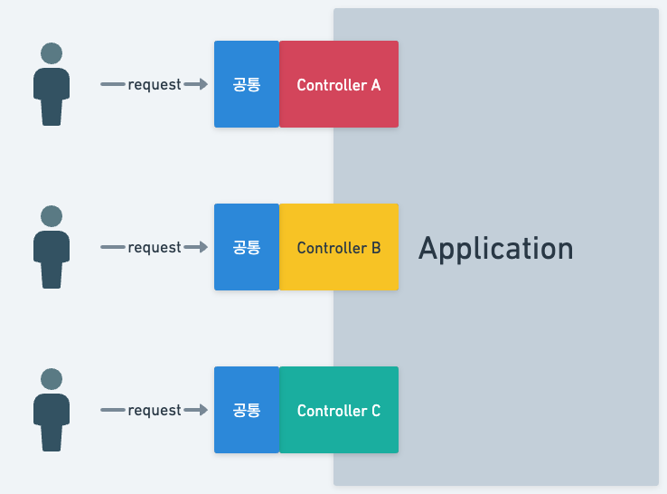
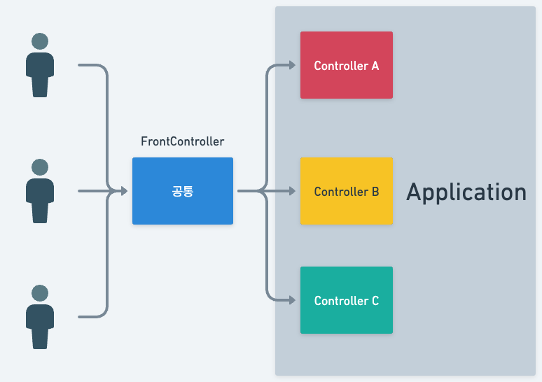
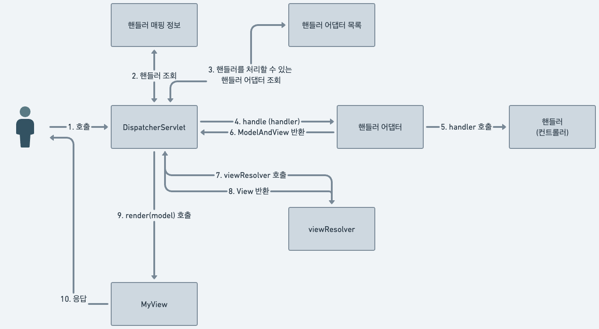
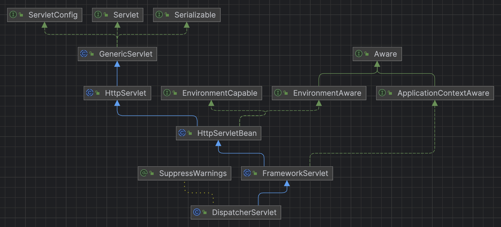

## FrontController 패턴
기존 서블릿을 이용하여 구현한 컨트롤러는 아래와 같은 공통 로직들이 들어간다.
```java
//사용자 입력 제공 컨트롤러
@WebServlet(name = "mvcMemberFormServlet", urlPatterns = "/servlet-mvc/members/new-form")
public class MvcMemberFormServlet extends HttpServlet {

    @Override
    protected void service(HttpServletRequest request, HttpServletResponse response) throws ServletException, IOException {
        String viewPath = "/WEB-INF/views/new-form.jsp";
        RequestDispatcher dispatcher = request.getRequestDispatcher(viewPath);
        dispatcher.forward(request, response);
    }
}

//사용자 리스트 컨트롤러
@WebServlet(name = "mvcMemberListServlet", urlPatterns = "/servlet-mvc/members")
public class MvcMemberListServlet extends HttpServlet {

    MemberRepository memberRepository = MemberRepository.getInstance();
    @Override
    protected void service(HttpServletRequest request, HttpServletResponse response) throws ServletException, IOException {
        //... 조회로직 처리

        //Model에 데이터 보관
        request.setAttribute("members", members);

        String viewPath = "/WEB-INF/views/members.jsp";
        RequestDispatcher dispatcher = request.getRequestDispatcher(viewPath);
        dispatcher.forward(request, response);
    }
}

//사용자 저장 컨트롤러
@WebServlet(name = "memberSaveServlet", urlPatterns = "/servlet/members/save")
public class MemberSaveServlet extends HttpServlet {

    MemberRepository memberRepository = MemberRepository.getInstance();
    @Override
    protected void service(HttpServletRequest request, HttpServletResponse response) throws ServletException, IOException {
        //... 저장 로직 처리
        
        //Model에 데이터 보관
        request.setAttribute("member", member);

        String viewPath = "/WEB-INF/views/save-result.jsp";
        RequestDispatcher dispatcher = request.getRequestDispatcher(viewPath);
        dispatcher.forward(request,response);
    }
}
```

코드들을 보면 모두 다음과 같은 중복이 일어난다.
* viewPath 중복
* dispatcher.forward 중복
* HttpServletRequest, HttpServletResponse 중복

또한 HttpServletResponse 의 경우 단지 forward 를 위해 집어넣어주는 경우도 있다.\
이런 중복되는 코드들은 개발이 진행 될 수록 점점 더 많아지게 된다. 공통 메서드로 빼도 되지만, 결국 해당 메소드들을 각 컨트롤러들이 호출 해주어야 하고,\
호출 로직을 빼먹으면 아예 호출이 되지 않아 문제 생기는 경우도 있다. 호출 자체도 중복이 된다.

이러한 문제를 해결하는 것이 FrontController 패턴이다. 프론트 컨트롤러 패턴은 각 컨트롤러별 흩어져 있는 공통된 코드를 하나의 컨트롤러로 모아주는 패턴이다.

FrontController 적용 전


FrontController 적용 후


FrontController 특징은 아래와 같다.
* 프론트 컨트롤러 서블릿 하나로 요청을 모두 받음.
* 프론트 컨트롤러에서 요청에 맞는 컨트롤러를 호출.
* 프론트 컨트롤러를 제외한 나머지는 서블릿 코드가 필요 없음.
* 공통 처리가 가능하며, 프론트 컨트롤러가 대문 역할을 함.

스프링에서 이 역할을 해주는 것이 바로 DispatcherServlet이다.

## DispatcherServlet
DispatcherServlet 은 스프링 MVC에서 프론트 컨트롤러 역할을 하는 클래스이다.\
들어오는 요청들에 대해 모두 받은 후 알맞은 컨트롤러로 전달해주는 역할을 한다. 그렇기에 HttpServlet을 상속 받아 처리되는 클래스다.\
DispatcherServlet 의 핵심은 들어오는 요청에 대해 핸들러(컨트롤러)를 찾아 실행하고, 그에 맞는 view를 처리해준다.

흐름은 아래와 같다.






DispatcherServlet 은 들어오는 모든 요청을 처리하므로 Servlet을 상속 받는다. 때문에 서블릿으로 동작하며, 당연히 service 메소드가 존재한다.

```java
public class DispatcherServlet extends FrameworkServlet {
    ...

    /**
     * Exposes the DispatcherServlet-specific request attributes and delegates to {@link #doDispatch}
     * for the actual dispatching.
     */
    @Override
    protected void doService(HttpServletRequest request, HttpServletResponse response) throws Exception {
        ...

        try {
            doDispatch(request, response);
        }
        finally {
        
        ...    
    }
    
    ...
}
```
요청 순서는 아래와 같다.
1. 요청이 들어오면 HttpServlet의 service 메소드가 실행된다.
2. 스프링은 DispatcherServlet 의 부모인 FrameworkServlet 에 서비스를 오버라이드 함.
3. FrameworkServlet.service()가 실행되면서 DispatcherServlet.doService() 실행.
4. 그리고 핵심인 doDispatch가 실행 됨.
5. doDispatch에서 위의 흐름에 있는 메소드들을 순서대로 호출하게 된다.

이렇게 doDispatch 메소드는 기존 Servlet에서 공통으로 처리하는 코드들을 모두 한 곳에서 처리하게 해준다. 그렇기에 개발자는
위의 기존 서블릿 컨트롤러 처럼 중복되는 코드들에 대해 따로 신경쓰지 않고 온전히 비즈니스 로직에 집중할 수 있도록 해준다.
